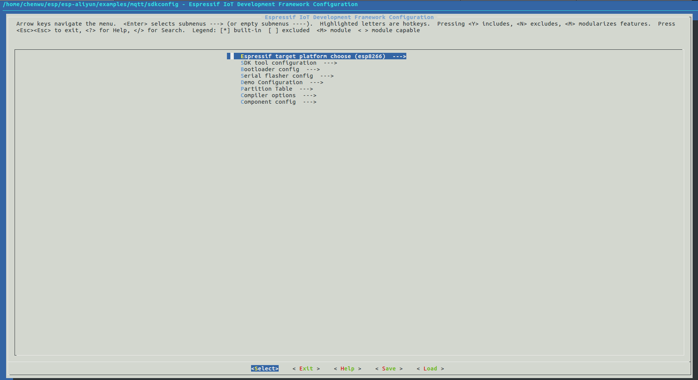
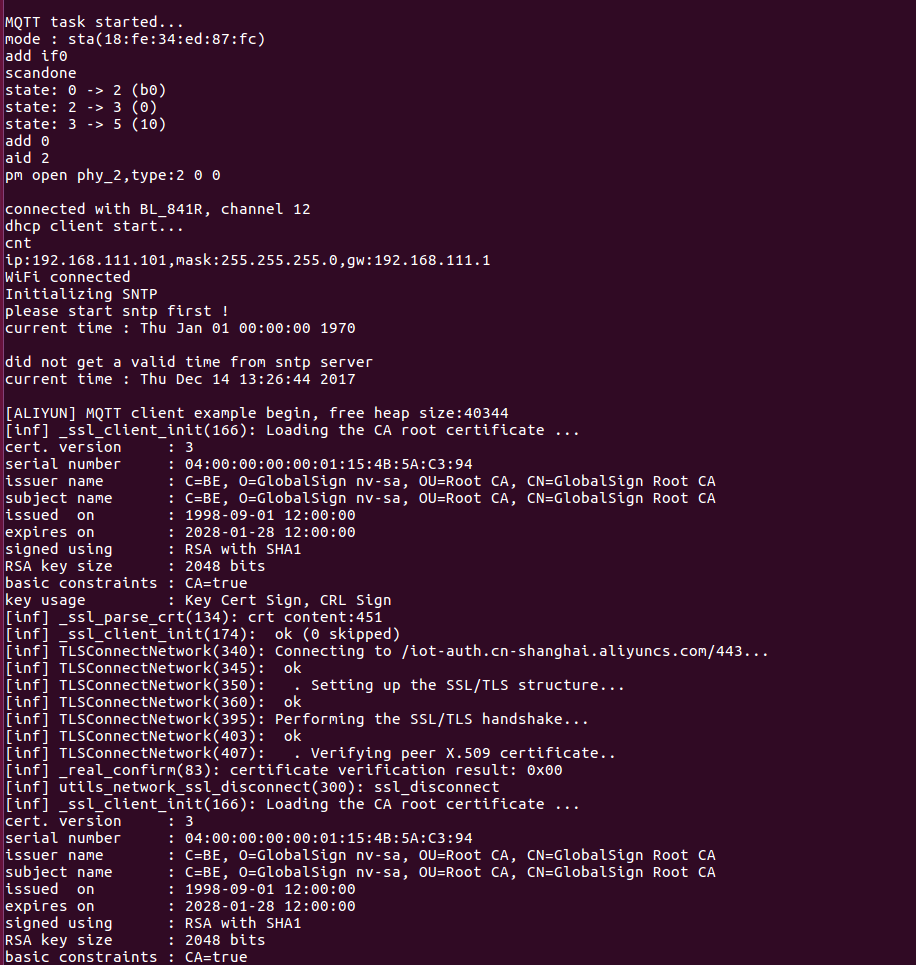
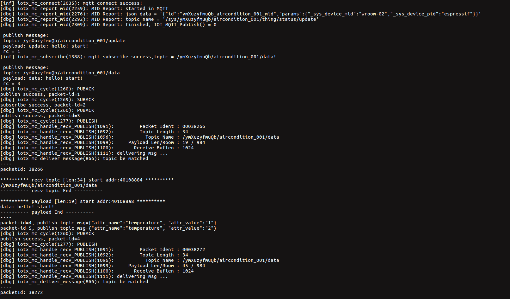
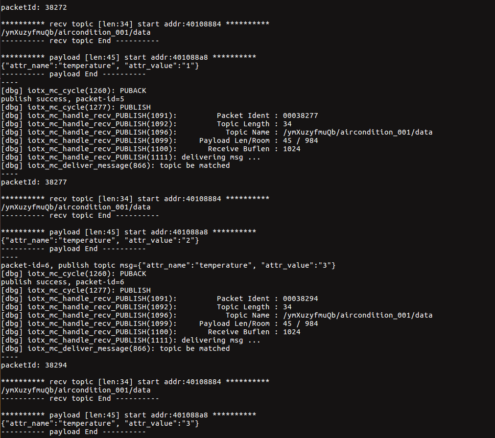

# ESP 设备对接阿里云指南
# 目录

- [介绍](#Introduction)  
- [一：目的](#aim)  
- [二：硬件准备](#hardwareprepare)  
- [三：阿里云平台准备](#aliyunprepare)  
- [四：环境搭建](#compileprepare)  
- [五：SDK 准备](#sdkprepare)  
- [六：编译&烧写&运行](#makeflash)  

# <span id = "Introduction">介绍</span>
[乐鑫](https://www.espressif.com/zh-hans)是高集成度芯片的设计专家，专注于设计简单灵活、易于制造和部署的解决方案。乐鑫研发和设计 IoT 业内集成度高、性能稳定、功耗低的无线系统级芯片，乐鑫的模组产品集成了自主研发的系统级芯片，因此具备强大的 Wi-Fi 和蓝牙功能，以及出色的射频性能。

[阿里云物联网套件](https://github.com/aliyun/iotkit-embedded)是阿里云专门为物联网领域的开发人员推出的，其目的是帮助开发者搭建安全性能强大的数据通道，方便终端（如传感器、执行器、嵌入式设备或智能家电等等）和云端的双向通信。全球多节点部署让海量设备全球范围都可以安全低延时接入阿里云IoT Hub，安全上提供多重防护保障设备云端安全，性能上能够支撑亿级设备长连接，百万消息并发。物联网套件还提供了一站式托管服务，数据从采集到计算到存储，用户无需购买服务器部署分布式架构，用户通过规则引擎只需在web上配置规则即可实现采集+计算+存储等全栈服务。总而言之，基于物联网套件提供的服务，物联网开发者可以快速搭建稳定可靠的物联网平台。

# <span id = "aim">一：目的</span>
本文基于 linux 环境，介绍 ESP 设备对接阿里云平台的具体流程，供读者参考。

# <span id = "hardwareprepare">二：硬件准备</span>
- **linux 环境**
用来编译  & 烧写 & 运行等操作的必须环境。  

> windows 用户可安装虚拟机，在虚拟机中安装 linux.

- **ESP 设备**  
ESP 设备包括 [ESP芯片](https://www.espressif.com/zh-hans/products/hardware/socs)，[ESP模组](https://www.espressif.com/zh-hans/products/hardware/modules)，[ESP开发板](https://www.espressif.com/zh-hans/products/hardware/development-boards)等。

- **USB 线**  
连接 PC 和 ESP 设备，用来烧写/下载程序，查看 log 等。

# <span id = "aliyunprepare">三：阿里云平台准备</span>
根据[阿里官方文档](https://github.com/aliyun/iotkit-embedded?spm=5176.doc42648.2.4.e9Zu05)，在阿里云平台创建产品，创建设备，同时自动产生 `product key`, `device name`, `device secret`。  
`product key`, `device name`, `device secret` 将在 6.1.2 节用到。

# <span id = "compileprepare">四：环境搭建</span>
**如果您熟悉 ESP 开发环境，可以很顺利理解下面步骤; 如果您不熟悉某个部分，比如编译，烧录，需要您结合官方的相关文档来理解。如您需阅读 [ESP-IDF 编程指南](https://docs.espressif.com/projects/esp-idf/zh_CN/latest/index.html)文档等。**  

## 4.1 编译器环境搭建
- ESP8266 平台: 根据[官方链接](https://github.com/espressif/ESP8266_RTOS_SDK)中 **Get toolchain**，获取 toolchain
- ESP32 平台：根据[官方链接](https://github.com/espressif/esp-idf/blob/master/docs/zh_CN/get-started/linux-setup.rst)中 **工具链的设置**，下载 toolchain

toolchain 设置参考 [ESP-IDF 编程指南](https://docs.espressif.com/projects/esp-idf/zh_CN/latest/get-started/index.html#get-started-setup-toolchain)。  
## 4.2 烧录工具/下载工具获取
- ESP8266 平台：烧录工具位于 [ESP8266_RTOS_SDK](https://github.com/espressif/ESP8266_RTOS_SDK) 下 `./components/esptool_py/esptool/esptool.py`
- ESP32 平台：烧录工具位于 [esp-idf](https://github.com/espressif/esp-idf) 下 `./components/esptool_py/esptool/esptool.py`

esptool 功能参考:  

```
$ ./components/esptool_py/esptool/esptool.py --help
```

# <span id = "sdkprepare">五：SDK 准备</span> 
- [esp-aliyun SDK](https://github.com/espressif/esp-aliyun), 通过该 SDK 可实现使用 MQTT 协议，连接 ESP 设备到阿里云.
- Espressif SDK
  - ESP32 平台: [ESP-IDF](https://github.com/espressif/esp-idf)
  - ESP8266 平台: [ESP8266_RTOS_SDK](https://github.com/espressif/ESP8266_RTOS_SDK)

> Espressif SDK 下载好后，请执行 `git checkout release/v3.0`

# <span id = "makeflash">六：编译 & 烧写 & 运行</span>
## 6.1 编译

### 6.1.1 导出编译器
参考 [工具链的设置](https://docs.espressif.com/projects/esp-idf/zh_CN/latest/get-started/linux-setup.html)

### 6.1.2 SDK 配置
```
cd esp-aliyun/examples/mqtt
make menuconfig
```



- 配置烧写串口
- 配置 `PRODUCT_KEY`, `DEVICE_NAME`, `DEVICE_SECRET`  
- 配置 `WIFI_SSID`, `WIFI_PASSWORD`

### 6.1.3 编译 SDK

```
$ make aliyun && make
```

## 6.2 擦除 & 编译烧写 & 下载固件 & 查看 log
将 USB 线连接好 ESP 设备和 PC,确保烧写端口正确。 

### 6.2.1[可选] 擦除 flash
```
$ make erase_flash
```

### 6.2.2 烧录程序
```
$ make flash
```

## 6.2.3 运行

```
$ make monitor
```

如将 ESP8266 拨至运行状态，即可看到如下 log：  
log 显示了 ESP8266 基于 TLS 建立了与阿里云的安全连接通路，接着通过 MQTT 协议订阅和发布消息，同时在阿里云控制台上，也能看到 ESP8266 推送的 MQTT 消息。  







> 也可执行 `make flash monitor` 来编译烧写和查看 log.
