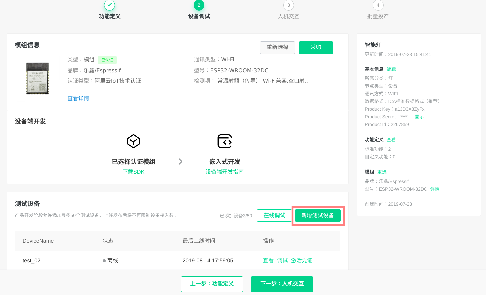
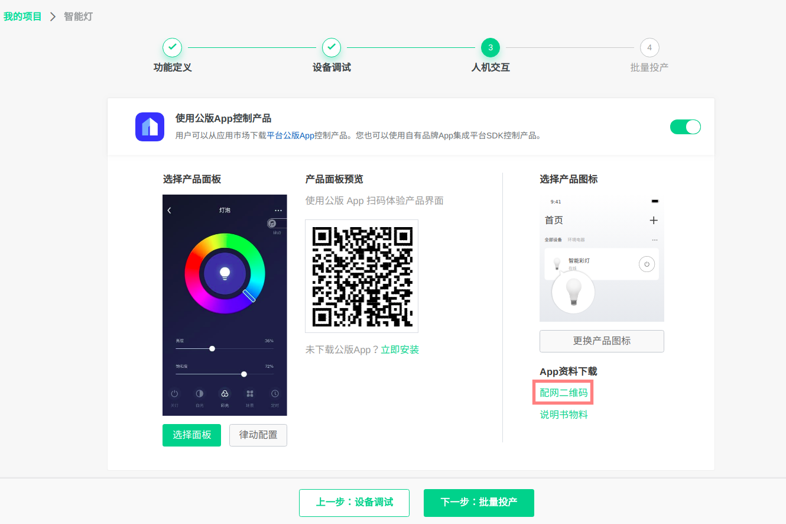
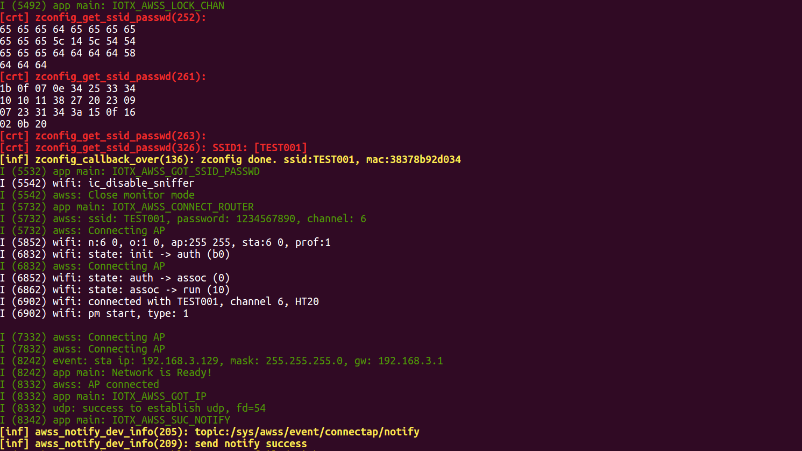

# AWSS 解决方案

### 介绍
`awss` 为客户提供配网解决方案. 设备可以通过阿里 <智能家居> APP 实现一键配网.

### 解决方案部署
#### 1.参考 [README](../../README.md) 文档进行硬件准备、环境搭建、SDK 准备

#### 2.阿里云平台部署  
在 [智能生活开放平台](https://living.aliyun.com/#/) 创建产品, 参考[创建产品文档](https://living.aliyun.com/doc#readygo.html).
> 配置较多, 如果不太懂, 也不用纠结, 后续都可以修改.
> 如果已经创建过产品, 可跳过此步骤.

新增测试设备, 此处即可以获得`三元组`, 后续需要烧录到 NVS 分区.


获取配网二维码, 后续设备配网中需扫描此二维码.



#### 3.下载本工程
   ```
    git clone https://github.com/espressif/esp-aliyun.git
    cd esp-aliyun
   ```

#### 4.烧录三元组信息  
- 参考 [量产说明](../../config/mass_mfg/README.md) 文档烧录三元组 NVS 分区。

> 如果重新配网, 请先执行 `make erase_flash`, 再烧录三元组.

#### 5.编译 `awss` 并烧录运行
```
cd examples/awss
make chip=esp32 defconfig 或者 make chip=esp8266 defconfig
make -j8 flash monitor
```

#### 6.设备第一次运行时, 会进入配网


#### 7.手机从[阿里巴巴官网](https://living.aliyun.com/doc#muti-app.html) 下载`智能家居`公版 APP, 国内用户版.

#### 8.注册好账号后,进入 APP, 右上角扫描, 扫描第二步的二维码配网.  
设备端配网成功后会保存 `ssid` 和 `password` :


> 由于示例仅提供配网功能, 没有与云端建立 MQTT 链接, 因此 APP 上不会弹出配网成功页面, 会显示 `设备添加失败`. 如果需要添加设备, 可以运行 examples/solutions/smart_light 示例.