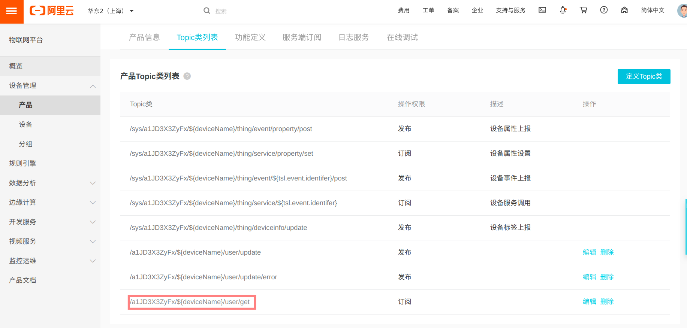
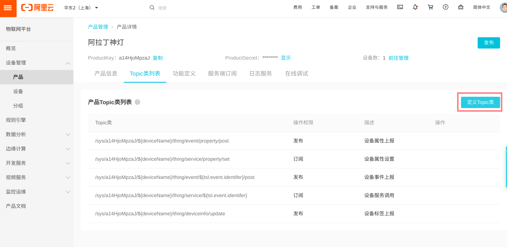
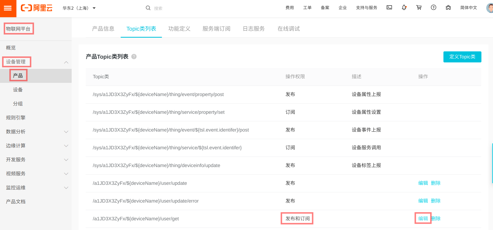
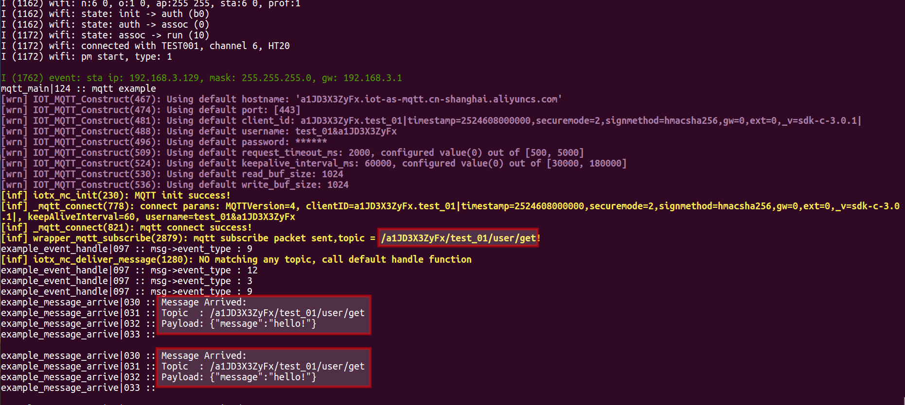

# MQTT 解决方案

### 介绍
`mqtt_example` 为客户提供连接阿里云, 演示发布和订阅功能.

### 解决方案部署
#### 1.参考 [README](../../../README.md) 文档进行硬件准备、环境搭建、SDK 准备

#### 2.阿里云平台部署
在阿里云 [物联网平台](https://iot.console.aliyun.com) 上创建产品. 产品 Topic 类列表如下:


如果已在阿里云 [生活物联网平台](https://living.aliyun.com/#/) 创建产品, 会显示在 `物联网平台`, 但需要手动增加 Topic 类 `/${productKey}/${deviceName}/user/get` .


修改 Topic `/${productKey}/${deviceName}/user/get` 的操作权限为 `发布和订阅`. 这样 MQTT 客户端可以收到自己发布的消息.


> 创建产品设备后,可以获取`三元组`, 后续需要烧录到 NVS 分区.

#### 3.下载本工程
   ```
    git clone https://github.com/espressif/esp-aliyun.git
    cd esp-aliyun
   ```

#### 4.烧录三元组信息
- 参考 [量产说明](../../../config/mass_mfg/README.md) 文档烧录三元组 NVS 分区。

> 如果执行了 `make erase_flash`, 需要重新烧录三元组.

#### 5.编译 `mqtt_example` 并烧录运行
```
cd examples/mqtt/mqtt_example
make chip=esp32 defconfig 或者 make chip=esp8266 defconfig
make menuconfig
```


- 配置烧写串口
- 配置 `WIFI_SSID`, `WIFI_PASSWORD`

```
make -j8 flash monitor
```

#### 6.设备运行

设备连接 WIFI 之后, 进行 MQTT 连接, 订阅和发布消息. 订阅和发布的 Topic 都是 `/${productKey}/${deviceName}/user/get` , 因此设备会收到自己发送的消息.



