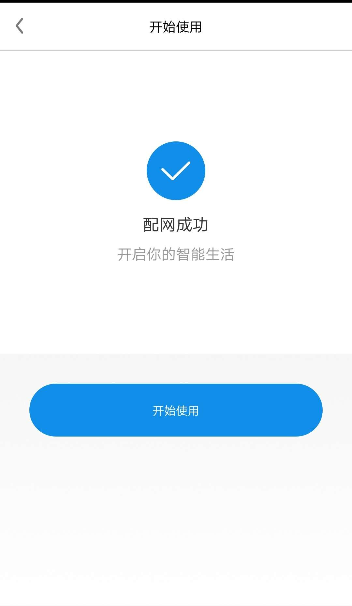
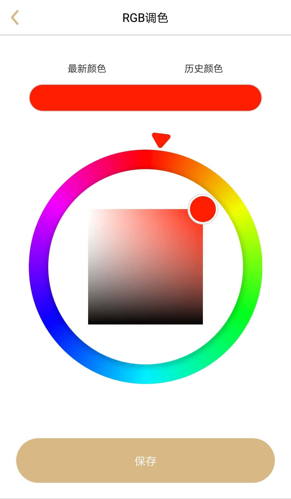

# Smart Light 解决方案

### 介绍
`Smart Light` 为客户提供智能灯产品的解决方案. 客户几乎不需要投入软件开发, 即可以:  
- 支持阿里 <智能家居> APP 一键配网
- 支持阿里 <智能家居> APP 控制设备
- 支持 LED 控制(开关,颜色等)
- 支持 OTA 升级

> 当前 `Smart Light` 不支持 ESP8266 平台, 后续即将支持

### 解决方案部署
#### 1.根据 [ESP-IDF 编程指南](https://docs.espressif.com/projects/esp-idf/zh_CN/latest/index.html) 能运行 [Hello World](https://github.com/espressif/esp-idf/tree/master/examples/get-started/hello_world)

#### 2.阿里云平台部署  
在 [智能生活开放平台](https://living.aliyun.com/#/) 创建产品, 参考[创建产品文档](https://living.aliyun.com/doc#readygo.html).
> 配置较多, 如果不太懂, 也不用纠结, 后续都可以修改.

部署自己的产品, 可参考如下:  
新增 RGB 调色功能:  


新增测试设备, 此处即可以获得`四元组`, 后续需要.  


配置界面定义好, 即手机 APP 上会显示同样界面; 二维码是贴在产品包装上, 终端客户给设备配网中需扫描此二维码.


#### 3.下载本工程
   ```
    git clone https://github.com/espressif/esp-aliyun.git
    cd esp-aliyun
    git submodule update --init --recursive
   ```

#### 4.编译 `libiot_sdk.a`  
`libiot_sdk.a` 是交叉编译 `C-SDK` 到 `IDF` 平台的产物, 详见[SDK overview](https://code.aliyun.com/edward.yangx/public-docs/wikis/user-guide/linkkit/SDK_Overview#%E5%BC%80%E5%8F%91%E5%AF%B9%E6%8E%A5%E7%9A%84HAL%E5%B1%82%E5%AE%9E%E7%8E%B0)
> 编译前, 请执行下面两步:  
> 1.使得阿里云 `SDK` 支持 `IDF` 平台编译: 拷贝 `src/board/config.esp8266.aos` 到 `src/board/config.esp32.aos`, 并更改 `BOARD_ESP8266` 为 `BOARD_ESP32`, 更改 `ESPOS_FOR_ESP8266` 为 `ESPOS_FOR_ESP32`, 更改 `xtensa-lx106-elf-` 为 `xtensa-esp32-elf-`  
> 2.暂时规避阿里云 SDK 内部逻辑处理欠妥地方: 注释 `iotkit-embedded/src/services/dev_bind/awss_timer.c` 第 21 行,  `// HAL_Timer_Delete(timer);` 

编译:  
```
cd iotkit-embedded
make reconfig
make
```

编译选项选择 1, 即 `esp32` 平台, make 后即编译好 `libiot_sdk.a`

> 重新编译 `libiot_sdk.a`, 请先执行: `rm output -rf && make clean && make distclean`

#### 5.配置 `smart light example`
- 第二步中的四元组填充到 `linkkit_example_solo.c` 中 `PRODUCT_KEY`, `PRODUCT_SECRET`, `DEVICE_NAME`, `DEVICE_SECRET`
- RGB 灯分别接 ESP32 开发板上 `GPIO4`, `GPIO5`, `GPIO21` (可在 `light_control.c` 中修改)

#### 6.编译 `smart light` 并烧录运行
```
make erase_flash
make defconfig
make -j8 flash monitor
```

> 在测试配网中, 请先执行 `make erase_flash`

#### 7.设备第一次运行时, 会进入配网


#### 8.手机从[阿里巴巴官网](https://living.aliyun.com/doc#muti-app.html) 下载`智能家居`公版 APP, 国内用户版.

#### 9.注册好账号后,进入 APP, 右上角扫描, 扫描第二步的二维码配网.  
设备端配网成功后会保存 `ssid` 和 `password` :


APP 上会弹出配网成功页面:


设备端联网成功后, 就可以和阿里云交互;  
APP 点击开始使用, 就可以控制智能灯状态了.

#### 10.控制智能灯颜色

在 APP 上设置 RGB 调色并保存:


设备端即解析 RGB 颜色, 并设置到具体的灯产品上.


#### 11.OTA 支持  
在[管理控制台](https://iot.console.aliyun.com/ota/list)上传固件, 验证固件后, 下发升级指令.


社会端收到升级指令后, 即开始 OTA:


升级完成后, 会立即重启运行新固件:


### 后续计划
- 支持天猫精灵控制
- 支持 ESP8266 平台
